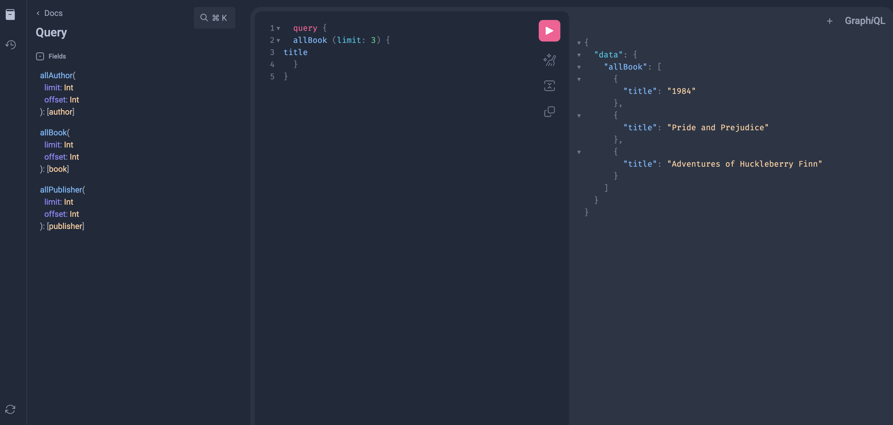
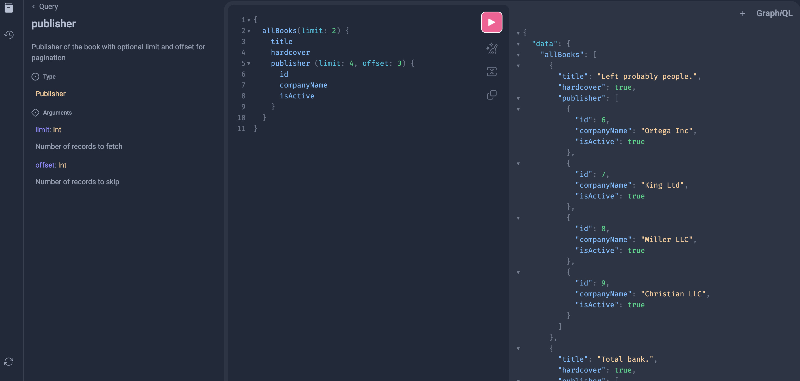

# GraphQL Database Schema and Query Endpoint

## Overview
This project dynamically generates a GraphQL schema based on database tables, enabling efficient querying and pagination for relational databases. It leverages SQLAlchemy for database inspection and Graphene for creating GraphQL types and fields dynamically.

The key functionality includes:
- Generating GraphQL types for database tables
- Creating GraphQL query fields for fetching data from tables
- Supporting pagination with limit and offset arguments

